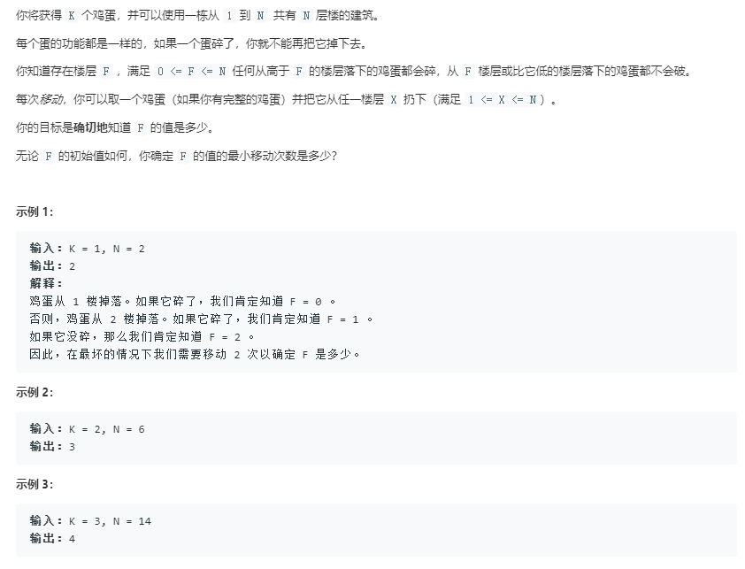

# 887. 鸡蛋掉落问题

4月11日的leetcode每日一题，这是一道谷歌经典的面试题，题目如下：



> 数据范围
>
> 1 <= K <= 100
>
> 1 <= N <= 10000

## 题目

在官方题解处看到了这么一段描述。。。


是不是题目都读不懂。。。这道题读起来有浓浓的机翻味，这里重新组织一下语言：

>  有K个软硬程度一样的鸡蛋，和N层楼，你不知道这些蛋从哪里扔下去会碎。你只能一个个试，每次你可以取一个鸡蛋从X层扔下（1 <= X <= N）。假设鸡蛋从F层及以下掉落不会碎，但是F层以上都会碎。请问想要得到确切的F，最少需要你移动几次。
>
> 注：鸡蛋扔下去没碎可以捡回来继续扔，碎了就不能用了。不包括下去捡蛋的移动。

可以结合上面的示例加深理解。

## 分析

这是经典动态规划问题。

**状态表示：**首先定义`f(i, j)`，表示有`i`个鸡蛋`j`层楼时，确定`F`值最少的移动次数。

**状态转移：**假设我们在x层楼扔下鸡蛋，有两种情况发生

 1. 鸡蛋碎了，则还有`i-1`个鸡蛋，F值肯定在x楼下面（1~x-1），故问题就变成了`f(i-1, x-1)`。

 2. 鸡蛋没碎，则还有`i`个鸡蛋，F值肯定在x楼上面（x+1~j），故问题规模就缩小成了`f(i, j-x)`。

 3. 最后得到状态转移方程：$f(i, j) = 1 + min(max(f(i - 1, x - 1), f(i, j - x))), 1<= x <= j$

    为什么是min(max())呢？

    首先要找到鸡蛋碎了和没碎中的最坏情况，因为你不能保证鸡蛋都是碎的，或者鸡蛋都没碎，假设每层鸡蛋都碎了，就会有最坏情况，全部楼层走一遍。只有最坏情况才能确定`F`值，故`max()`。

    其次，在所有楼层上都扔一遍，暴搜一下，得到最少需要移动的次数，故`min()`。

    最后，+1是当前扔鸡蛋的操作，不管碎没碎都算是移动了一次。

**时间复杂度：**状态表示是$O(K*N)$，状态计算的复杂度是$N$，故整体的时间复杂度是$O(KN^2)$

​			由题目的数据范围可知$KN^2 = 100 * 1e4 * 1e4 = 1e10​$。超时了！！！

## 二分查找

二分主要解决x的搜索问题。先找上面两个函数有没有单调性，设：
$$
T_1(x) = f(i-1, x-1)\\
T_2(x) = f(i, j-x)
$$
看`f(K, N)`这个函数可知，N越大，即楼层越高，确定`F`值所需的次数肯定不会变小，故函数是单调递增的。

则$T_1(x)​$是单调递增函数，$T_2(x)​$是单调递减函数。$max(T_1(x), T_2(x))​$可以用下图函数蓝色的那段表示出来：


那么$min(max(T_1(x), T_2(x)))$就是红色那个交点，由于该题的x是离散的，所以答案应该在距离交点最近的左右两个整数点x0和x1上，只要求$min(max(T_1(x0), T_2(x0)), max(T_1(x_1), T_2(x_1)))$就行了，这样就把x的搜索从O(N)缩小到了O(logN)，易证：x1 = x0 + 1。

所以我们只需要找到x0就行了，x0的性质是T1(x0) <= T2(x0)最大的那个点，二分的写法如下：

```cpp
int l = 1, r = j;
while(l < r){
    int mid = l + r + 1 >> 1;
    if(T1(mid) <= T2(mid)) l = mid;
    r = mid - 1;
}

int x0 = l, x1 = l + 1;
int max_x1, max_x2 = 1e9;
max_x1 = max(f[i - 1][x0 - 1], f[i][j - x0]);
if(x1 <= j){
    max_x2 = max(f[i - 1][x1 - 1], f[i][j - x1]);
}
f[i][j] = 1 + min(max_x1, max_x2);
```

>  在判断二分条件时，要根据x0的性质来判断，如果x0的性质是T1(x0) < T2(x0)，则二分条件也要写成<，找到的x是不包括交点的交点左边第一个点。

## 边界

这道题的边界很重要，我在边界上面卡了很久，考虑两个边界：

1. 当`j == 0`时，`f(i, 0) = 0`，因为0层楼的情况下，不管有几个蛋，移动次数都是0。
2. 当`i == 1`时，`f(1, j) = j`，当只有一个蛋的时候，就只能从1楼往上线性的走，一个一个扔蛋，扔到会碎的那一层为止，故移动次数是j。

最后代码如下：

```cpp
class Solution {
public:

    int superEggDrop(int K, int N) {
        int f[K + 1][N + 1];
        memset(f, 0, sizeof f);
        for(int i = 0; i <= N; i++) f[1][i] = i;

        for(int i = 2; i <= K; i++){
            for(int j = 1; j <= N; j++){
                int l = 1, r = j;
                while(l < r){
                    int mid = l + r + 1 >> 1;
                    if(f[i - 1][mid - 1] <= f[i][j - mid]) l = mid;
                    else r = mid - 1;
                }
                
                int x0 = l, x1 = l + 1;
                int max_x1, max_x2 = 1e9;
                max_x1 = max(f[i - 1][x0 - 1], f[i][j - x0]);
                if(x1 <= j){
                    max_x2 = max(f[i - 1][x1 - 1], f[i][j - x1]);
                }
                f[i][j] = 1 + min(max_x1, max_x2);
            }
        }
        return f[K][N];
    }
    
};

```


